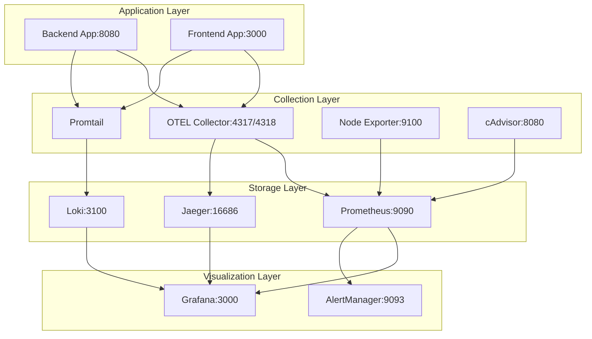

# Observability and Monitoring

This guide covers the comprehensive observability stack for DealSphere, including metrics collection, logging, distributed tracing, alerting, and performance monitoring across all environments.

## Overview

DealSphere uses a modern observability stack that provides full visibility into application performance, infrastructure health, and user experience:

- **Metrics**: Prometheus + Grafana for time-series data and visualization
- **Logging**: Loki + Promtail for centralized log aggregation
- **Tracing**: Jaeger + OpenTelemetry for distributed request tracing
- **Alerting**: AlertManager for proactive issue detection
- **Infrastructure Monitoring**: Node Exporter + cAdvisor for system metrics

## Quick Start

### 1. Start the Monitoring Stack

```bash
cd monitoring
docker compose -f docker-compose.monitoring.yml up -d
```

### 2. Access Dashboards

| Service | URL | Credentials |
|---------|-----|-------------|
| **Grafana** | http://localhost:3000 | admin/admin123 |
| **Prometheus** | http://localhost:9090 | - |
| **Jaeger** | http://localhost:16686 | - |
| **AlertManager** | http://localhost:9093 | - |

### 3. Verify Metrics Collection

```bash
# Check backend metrics
curl http://localhost:8080/actuator/prometheus
curl http://localhost:8080/actuator/health

# Check monitoring stack health
docker compose -f docker-compose.monitoring.yml ps
```

## Monitoring Stack Architecture

### Service Overview

| Service | Port | Purpose | Data Retention |
|---------|------|---------|----------------|
| **Prometheus** | 9090 | Metrics storage & querying | 30 days / 10GB |
| **Grafana** | 3000 | Dashboards & visualization | Persistent |
| **Loki** | 3100 | Log aggregation | 30 days |
| **Promtail** | - | Log collection agent | - |
| **Jaeger** | 16686 | Distributed tracing UI | 24 hours |
| **AlertManager** | 9093 | Alert management & routing | 5 days |
| **Node Exporter** | 9100 | System metrics collection | - |
| **cAdvisor** | 8080 | Container metrics | - |
| **OTEL Collector** | 4317/4318 | Telemetry data collection | - |

### Network Architecture



## Metrics Collection

### Backend Metrics (Spring Boot + Micrometer)

The backend automatically exposes comprehensive metrics via Spring Boot Actuator:

#### Available Endpoints

```bash
# Health status with detailed checks
GET /actuator/health

# All available metrics
GET /actuator/metrics

# Prometheus-formatted metrics
GET /actuator/prometheus

# Application info
GET /actuator/info

# Environment variables
GET /actuator/env

# Configuration properties
GET /actuator/configprops
```

#### Key Metrics Categories

**HTTP Request Metrics**
- `http_server_requests_seconds` - Request duration percentiles
- `http_server_requests_total` - Request count by status code
- `http_server_active_requests` - Currently active requests

**JVM Metrics**
- `jvm_memory_used_bytes` - Memory usage by pool
- `jvm_gc_pause_seconds` - Garbage collection pause times
- `jvm_threads_live_threads` - Active thread count
- `jvm_classes_loaded_classes` - Loaded class count

**Database Metrics**
- `hikaricp_connections_active` - Active database connections
- `hikaricp_connections_pending` - Pending connection requests
- `hikaricp_connections_timeout_total` - Connection timeouts

**GraphQL Metrics**
- `graphql_request_seconds` - GraphQL operation duration
- `graphql_error_total` - GraphQL errors by type
- `graphql_request_total` - GraphQL requests by operation

**Custom Business Metrics**
```java
@Component
public class BusinessMetrics {
    private final MeterRegistry meterRegistry;
    private final Counter userLoginAttempts;
    private final Timer orderProcessingTime;
    private final Gauge activeUserSessions;

    public BusinessMetrics(MeterRegistry meterRegistry, SessionService sessionService) {
        this.meterRegistry = meterRegistry;

        this.userLoginAttempts = Counter.builder("user.login.attempts")
            .description("Total user login attempts")
            .tag("status", "success")
            .register(meterRegistry);

        this.orderProcessingTime = Timer.builder("order.processing.time")
            .description("Time taken to process orders")
            .register(meterRegistry);

        this.activeUserSessions = Gauge.builder("user.sessions.active")
            .description("Number of active user sessions")
            .register(meterRegistry, sessionService, SessionService::getActiveCount);
    }

    public void recordLoginAttempt(boolean success) {
        userLoginAttempts.increment(Tags.of("status", success ? "success" : "failure"));
    }

    public void recordOrderProcessing(Duration duration) {
        orderProcessingTime.record(duration);
    }
}
```

### Frontend Metrics (OpenTelemetry Web)

Frontend telemetry captures user experience and performance metrics:

#### Web Vitals Tracking
```javascript
// src/utils/telemetry.js
import { getWebVitals } from 'web-vitals';

export class MetricsCollector {
    constructor() {
        this.init();
    }

    init() {
        // Initialize OpenTelemetry Web SDK
        this.setupWebVitals();
        this.setupUserInteractions();
        this.setupAPITracking();
    }

    setupWebVitals() {
        getWebVitals(({ name, value, rating }) => {
            this.recordMetric(`web_vital_${name.toLowerCase()}`, value, {
                rating,
                timestamp: Date.now()
            });
        });
    }

    trackUserInteraction(action, element, metadata = {}) {
        this.recordMetric('user_interaction', 1, {
            action,
            element,
            page: window.location.pathname,
            ...metadata
        });
    }

    trackAPICall(endpoint, method, duration, statusCode) {
        this.recordMetric('api_call_duration', duration, {
            endpoint,
            method,
            status_code: statusCode,
            success: statusCode < 400
        });
    }

    trackPageView(path, loadTime) {
        this.recordMetric('page_view', 1, {
            path,
            load_time: loadTime,
            timestamp: Date.now()
        });
    }

    recordMetric(name, value, labels = {}) {
        // Send to OpenTelemetry Collector
        fetch('/api/metrics', {
            method: 'POST',
            headers: { 'Content-Type': 'application/json' },
            body: JSON.stringify({ name, value, labels, timestamp: Date.now() })
        });
    }
}

// Usage in components
const metricsCollector = new MetricsCollector();

// Track button clicks
metricsCollector.trackUserInteraction('click', 'search_button', {
    search_term: 'electronics'
});

// Track API performance
const startTime = performance.now();
const result = await api.fetchProducts();
const duration = performance.now() - startTime;
metricsCollector.trackAPICall('/api/products', 'GET', duration, 200);
```

## Logging Strategy

### Structured Logging Configuration

#### Backend Logging (Logback)

```xml
<!-- src/main/resources/logback-spring.xml -->
<configuration>
    <springProfile name="!local">
        <appender name="STDOUT" class="ch.qos.logback.core.ConsoleAppender">
            <encoder class="net.logstash.logback.encoder.LogstashEncoder">
                <customFields>{"service":"dealsphere-backend","version":"${app.version:-unknown}"}</customFields>
                <fieldNames>
                    <timestamp>@timestamp</timestamp>
                    <message>message</message>
                    <level>level</level>
                    <thread>thread</thread>
                    <logger>logger</logger>
                </fieldNames>
                <includeContext>true</includeContext>
                <includeMdc>true</includeMdc>
            </encoder>
        </appender>
    </springProfile>

    <springProfile name="local">
        <appender name="STDOUT" class="ch.qos.logback.core.ConsoleAppender">
            <encoder>
                <pattern>%d{yyyy-MM-dd HH:mm:ss.SSS} [%thread] %-5level [%X{traceId:-},%X{spanId:-}] %logger{36} - %msg%n</pattern>
            </encoder>
        </appender>
    </springProfile>

    <appender name="FILE" class="ch.qos.logback.core.rolling.RollingFileAppender">
        <file>/var/log/dealsphere/application.log</file>
        <rollingPolicy class="ch.qos.logback.core.rolling.TimeBasedRollingPolicy">
            <fileNamePattern>/var/log/dealsphere/application.%d{yyyy-MM-dd}.%i.log</fileNamePattern>
            <maxFileSize>100MB</maxFileSize>
            <maxHistory>30</maxHistory>
            <totalSizeCap>3GB</totalSizeCap>
        </rollingPolicy>
        <encoder class="net.logstash.logback.encoder.LogstashEncoder">
            <customFields>{"service":"dealsphere-backend"}</customFields>
        </encoder>
    </appender>

    <logger name="com.dealsphere" level="INFO"/>
    <logger name="org.springframework.security" level="WARN"/>
    <logger name="org.hibernate.SQL" level="DEBUG"/>

    <root level="INFO">
        <appender-ref ref="STDOUT"/>
        <appender-ref ref="FILE"/>
    </root>
</configuration>
```

#### Structured Logging Examples

```java
// Using structured logging with MDC
import org.slf4j.MDC;

@Service
public class UserService {
    private static final Logger logger = LoggerFactory.getLogger(UserService.class);

    public User createUser(CreateUserRequest request) {
        MDC.put("operation", "create_user");
        MDC.put("user_email", request.getEmail());

        try {
            logger.info("Creating new user account");

            User user = userRepository.save(new User(request));

            logger.info("User account created successfully",
                kv("user_id", user.getId()),
                kv("organization_id", user.getOrganizationId()));

            return user;
        } catch (Exception e) {
            logger.error("Failed to create user account",
                kv("error", e.getMessage()), e);
            throw e;
        } finally {
            MDC.clear();
        }
    }
}
```

### Log Aggregation with Loki

#### Promtail Configuration

```yaml
# promtail/promtail-config.yml
server:
  http_listen_port: 9080
  grpc_listen_port: 0

positions:
  filename: /tmp/positions.yaml

clients:
  - url: http://loki:3100/loki/api/v1/push

scrape_configs:
  # Application logs
  - job_name: dealsphere-backend
    static_configs:
      - targets:
          - localhost
        labels:
          job: dealsphere-backend
          service: backend
          environment: ${ENVIRONMENT:-development}
          __path__: /var/log/dealsphere/application*.log

  # Docker container logs
  - job_name: containers
    static_configs:
      - targets:
          - localhost
        labels:
          job: containerlogs
          __path__: /var/lib/docker/containers/*/*log

    pipeline_stages:
      - json:
          expressions:
            output: log
            stream: stream
            attrs:
      - json:
          source: attrs
          expressions:
            tag:
      - regex:
          source: tag
          expression: (?P<service_name>(?:[^|]*))\|
      - labels:
          service_name:
          stream:

  # System logs
  - job_name: syslog
    static_configs:
      - targets:
          - localhost
        labels:
          job: syslog
          __path__: /var/log/syslog

  # Nginx access logs
  - job_name: nginx
    static_configs:
      - targets:
          - localhost
        labels:
          job: nginx
          __path__: /var/log/nginx/*log

    pipeline_stages:
      - regex:
          expression: '(?P<remote_addr>\S+) - (?P<remote_user>\S+) \[(?P<time_local>[^\]]+)\] "(?P<method>\S+) (?P<request_uri>\S+) (?P<protocol>\S+)" (?P<status>\d+) (?P<body_bytes_sent>\d+) "(?P<http_referer>[^"]*)" "(?P<http_user_agent>[^"]*)"'
      - labels:
          method:
          status:
          remote_addr:
```

## Distributed Tracing

### OpenTelemetry Configuration

#### Backend Tracing Setup

```java
// Automatic instrumentation via Java agent
// Add to Dockerfile:
// COPY opentelemetry-javaagent.jar /app/
// ENV JAVA_TOOL_OPTIONS="-javaagent:/app/opentelemetry-javaagent.jar"

// Manual instrumentation for custom spans
@Service
public class OrderService {
    private final Tracer tracer;

    public OrderService() {
        this.tracer = GlobalOpenTelemetry.getTracer("dealsphere-backend");
    }

    @NewSpan("process_order")
    public Order processOrder(@SpanAttribute("order_id") String orderId) {
        Span span = tracer.spanBuilder("order.validation")
            .setSpanKind(SpanKind.INTERNAL)
            .startSpan();

        try (Scope scope = span.makeCurrent()) {
            span.setStatus(StatusCode.OK);
            span.addEvent("Order validation started");

            // Business logic here
            validateOrder(orderId);

            span.addEvent("Order validation completed");
            return processPayment(orderId);
        } catch (Exception e) {
            span.setStatus(StatusCode.ERROR, e.getMessage());
            span.recordException(e);
            throw e;
        } finally {
            span.end();
        }
    }
}
```

#### Frontend Tracing Setup

```javascript
// src/utils/tracing.js
import { WebTracerProvider } from '@opentelemetry/sdk-trace-web';
import { Resource } from '@opentelemetry/resources';
import { SemanticResourceAttributes } from '@opentelemetry/semantic-conventions';
import { BatchSpanProcessor } from '@opentelemetry/sdk-trace-base';
import { OTLPTraceExporter } from '@opentelemetry/exporter-otlp-http';

const provider = new WebTracerProvider({
  resource: new Resource({
    [SemanticResourceAttributes.SERVICE_NAME]: 'dealsphere-frontend',
    [SemanticResourceAttributes.SERVICE_VERSION]: '1.0.0',
  }),
});

const exporter = new OTLPTraceExporter({
  url: 'http://localhost:4318/v1/traces',
});

provider.addSpanProcessor(new BatchSpanProcessor(exporter));
provider.register();

export const tracer = provider.getTracer('dealsphere-frontend');

// Usage in React components
export const withTracing = (WrappedComponent, spanName) => {
  return (props) => {
    useEffect(() => {
      const span = tracer.startSpan(spanName);
      span.setAttributes({
        'component.name': WrappedComponent.name,
        'user.id': getCurrentUserId(),
      });

      return () => span.end();
    }, []);

    return <WrappedComponent {...props} />;
  };
};

// Track user interactions
export const trackUserAction = (action, metadata = {}) => {
  const span = tracer.startSpan(`user.${action}`);
  span.setAttributes({
    'user.action': action,
    'page.url': window.location.href,
    ...metadata
  });
  span.end();
};
```

### OpenTelemetry Collector Configuration

```yaml
# otel/otel-collector-config.yml
receivers:
  otlp:
    protocols:
      grpc:
        endpoint: 0.0.0.0:4317
      http:
        endpoint: 0.0.0.0:4318

processors:
  batch:
  resource:
    attributes:
      - key: environment
        value: ${ENVIRONMENT}
        action: insert
      - key: service.version
        value: ${SERVICE_VERSION}
        action: insert

exporters:
  # Traces to Jaeger
  jaeger:
    endpoint: jaeger:14250
    tls:
      insecure: true

  # Metrics to Prometheus
  prometheus:
    endpoint: "0.0.0.0:8889"

  # Logs to Loki
  loki:
    endpoint: http://loki:3100/loki/api/v1/push

service:
  pipelines:
    traces:
      receivers: [otlp]
      processors: [resource, batch]
      exporters: [jaeger]

    metrics:
      receivers: [otlp]
      processors: [resource, batch]
      exporters: [prometheus]

    logs:
      receivers: [otlp]
      processors: [resource, batch]
      exporters: [loki]
```

## Alerting Configuration

### Prometheus Alert Rules

```yaml
# prometheus/alert_rules.yml
groups:
  - name: dealsphere.rules
    rules:
      # Application alerts
      - alert: ApplicationDown
        expr: up{job="dealsphere-backend"} == 0
        for: 1m
        labels:
          severity: critical
        annotations:
          summary: "DealSphere application is down"
          description: "Application {{ $labels.instance }} has been down for more than 1 minute"

      - alert: HighErrorRate
        expr: rate(http_server_requests_total{status=~"5.."}[5m]) / rate(http_server_requests_total[5m]) > 0.1
        for: 5m
        labels:
          severity: critical
        annotations:
          summary: "High error rate detected"
          description: "Error rate is {{ $value | humanizePercentage }} for {{ $labels.instance }}"

      - alert: HighResponseTime
        expr: histogram_quantile(0.95, rate(http_server_requests_seconds_bucket[5m])) > 2
        for: 10m
        labels:
          severity: warning
        annotations:
          summary: "High response time"
          description: "95th percentile response time is {{ $value }}s for {{ $labels.instance }}"

      # Infrastructure alerts
      - alert: HighCPUUsage
        expr: 100 - (avg by(instance) (irate(node_cpu_seconds_total{mode="idle"}[5m])) * 100) > 80
        for: 10m
        labels:
          severity: warning
        annotations:
          summary: "High CPU usage"
          description: "CPU usage is {{ $value }}% on {{ $labels.instance }}"

      - alert: HighMemoryUsage
        expr: (1 - (node_memory_MemAvailable_bytes / node_memory_MemTotal_bytes)) * 100 > 90
        for: 5m
        labels:
          severity: critical
        annotations:
          summary: "High memory usage"
          description: "Memory usage is {{ $value }}% on {{ $labels.instance }}"

      - alert: LowDiskSpace
        expr: (1 - (node_filesystem_avail_bytes{fstype!="tmpfs"} / node_filesystem_size_bytes)) * 100 > 90
        for: 5m
        labels:
          severity: critical
        annotations:
          summary: "Low disk space"
          description: "Disk usage is {{ $value }}% on {{ $labels.instance }}"

      # Database alerts
      - alert: DatabaseConnectionsHigh
        expr: hikaricp_connections_active / hikaricp_connections_max > 0.8
        for: 5m
        labels:
          severity: warning
        annotations:
          summary: "High database connection usage"
          description: "Database connection pool is {{ $value | humanizePercentage }} full"

      - alert: DatabaseSlowQueries
        expr: rate(hikaricp_connections_timeout_total[5m]) > 0.1
        for: 5m
        labels:
          severity: warning
        annotations:
          summary: "Database connection timeouts"
          description: "Database connection timeout rate: {{ $value }}/s"

      # Business metrics alerts
      - alert: LowUserActivity
        expr: rate(user_login_attempts_total[1h]) < 10
        for: 30m
        labels:
          severity: warning
        annotations:
          summary: "Low user activity"
          description: "User login rate is {{ $value }}/hour"
```

### AlertManager Configuration

```yaml
# alertmanager/alertmanager.yml
global:
  smtp_smarthost: '${SMTP_HOST}:587'
  smtp_from: 'alerts@dealsphere.com'
  smtp_auth_username: '${SMTP_USERNAME}'
  smtp_auth_password: '${SMTP_PASSWORD}'

route:
  group_by: ['alertname', 'cluster', 'service']
  group_wait: 10s
  group_interval: 10s
  repeat_interval: 1h
  receiver: 'default'
  routes:
    - match:
        severity: critical
      receiver: 'critical-alerts'
    - match:
        severity: warning
      receiver: 'warning-alerts'

receivers:
  - name: 'default'
    email_configs:
      - to: 'devops@dealsphere.com'
        subject: 'DealSphere Alert: {{ .GroupLabels.alertname }}'
        body: |
          {{ range .Alerts }}
          Alert: {{ .Annotations.summary }}
          Description: {{ .Annotations.description }}
          Instance: {{ .Labels.instance }}
          Severity: {{ .Labels.severity }}
          {{ end }}

  - name: 'critical-alerts'
    email_configs:
      - to: 'oncall@dealsphere.com'
        subject: '🚨 CRITICAL: {{ .GroupLabels.alertname }}'
    slack_configs:
      - api_url: '${SLACK_WEBHOOK_URL}'
        channel: '#alerts-critical'
        title: '🚨 Critical Alert'
        text: |
          {{ range .Alerts }}
          *{{ .Annotations.summary }}*
          {{ .Annotations.description }}
          {{ end }}

  - name: 'warning-alerts'
    email_configs:
      - to: 'devops@dealsphere.com'
        subject: '⚠️ WARNING: {{ .GroupLabels.alertname }}'
    slack_configs:
      - api_url: '${SLACK_WEBHOOK_URL}'
        channel: '#alerts-warning'
        title: '⚠️ Warning Alert'
        text: |
          {{ range .Alerts }}
          *{{ .Annotations.summary }}*
          {{ .Annotations.description }}
          {{ end }}

inhibit_rules:
  - source_match:
      severity: 'critical'
    target_match:
      severity: 'warning'
    equal: ['alertname', 'instance']
```

## Grafana Dashboards

### Application Dashboard Configuration

```json
{
  "dashboard": {
    "id": null,
    "title": "DealSphere Application Overview",
    "tags": ["dealsphere", "application"],
    "timezone": "browser",
    "panels": [
      {
        "title": "Request Rate",
        "type": "graph",
        "targets": [
          {
            "expr": "rate(http_server_requests_total[5m])",
            "legendFormat": "{{ instance }} - {{ method }} {{ uri }}"
          }
        ]
      },
      {
        "title": "Response Time (95th percentile)",
        "type": "graph",
        "targets": [
          {
            "expr": "histogram_quantile(0.95, rate(http_server_requests_seconds_bucket[5m]))",
            "legendFormat": "{{ instance }}"
          }
        ]
      },
      {
        "title": "Error Rate",
        "type": "graph",
        "targets": [
          {
            "expr": "rate(http_server_requests_total{status=~\"5..\"}[5m]) / rate(http_server_requests_total[5m])",
            "legendFormat": "{{ instance }}"
          }
        ]
      },
      {
        "title": "Active Database Connections",
        "type": "graph",
        "targets": [
          {
            "expr": "hikaricp_connections_active",
            "legendFormat": "Active Connections"
          },
          {
            "expr": "hikaricp_connections_max",
            "legendFormat": "Max Connections"
          }
        ]
      }
    ]
  }
}
```

### Infrastructure Dashboard

Key panels for infrastructure monitoring:

- **System Overview**: CPU, Memory, Disk usage across all hosts
- **Network**: Network I/O, connections, packet loss
- **Container Metrics**: Docker container resource usage
- **Database Performance**: Query times, connection pools, locks
- **Application JVM**: Heap usage, GC performance, thread counts

## Performance Monitoring

### SLA/SLO Tracking

```yaml
# Service Level Objectives
slos:
  availability:
    target: 99.9%
    measurement: up{job="dealsphere-backend"}

  response_time:
    target: 95% < 2s
    measurement: histogram_quantile(0.95, rate(http_server_requests_seconds_bucket[5m]))

  error_rate:
    target: < 1%
    measurement: rate(http_server_requests_total{status=~"5.."}[5m]) / rate(http_server_requests_total[5m])
```

### Capacity Planning Queries

```promql
# CPU utilization trend
avg_over_time(100 - (avg by(instance) (irate(node_cpu_seconds_total{mode="idle"}[5m])) * 100)[7d:1h])

# Memory usage growth
increase(node_memory_MemTotal_bytes - node_memory_MemAvailable_bytes[7d])

# Request volume projection
predict_linear(rate(http_server_requests_total[1h])[7d:1h], 7*24*3600)

# Database connection pool utilization
avg_over_time((hikaricp_connections_active / hikaricp_connections_max)[7d:1h])
```

## Security Monitoring

### Security Metrics

```java
// Track security events
@Component
public class SecurityMetrics {
    private final Counter failedLogins;
    private final Counter suspiciousActivity;
    private final Timer authenticationTime;

    public SecurityMetrics(MeterRegistry registry) {
        this.failedLogins = Counter.builder("security.login.failed")
            .description("Failed login attempts")
            .tag("type", "authentication")
            .register(registry);

        this.suspiciousActivity = Counter.builder("security.suspicious.activity")
            .description("Suspicious user activity detected")
            .register(registry);

        this.authenticationTime = Timer.builder("security.authentication.time")
            .description("Time taken for authentication")
            .register(registry);
    }
}
```

### Security Alerts

```yaml
# Security-focused alert rules
- alert: HighFailedLoginRate
  expr: rate(security_login_failed_total[5m]) > 10
  for: 2m
  labels:
    severity: warning
  annotations:
    summary: "High failed login rate detected"

- alert: SuspiciousActivity
  expr: increase(security_suspicious_activity_total[5m]) > 5
  for: 1m
  labels:
    severity: critical
  annotations:
    summary: "Suspicious user activity detected"
```

## Troubleshooting

### Common Issues

**No Metrics Appearing**
```bash
# Check application health
curl http://localhost:8080/actuator/health

# Verify Prometheus targets
curl http://localhost:9090/api/v1/targets

# Check network connectivity
docker compose -f docker-compose.monitoring.yml logs prometheus
```

**Missing Traces**
```bash
# Verify OpenTelemetry configuration
curl http://localhost:4318/v1/traces

# Check sampling configuration
echo "OTEL_TRACES_SAMPLER=always_on" >> .env

# Inspect Jaeger
curl http://localhost:16686/api/services
```

**High Resource Usage**
```bash
# Adjust retention policies
# Edit prometheus/prometheus.yml
retention.time: 15d
retention.size: 5GB

# Reduce scrape intervals
scrape_interval: 30s
```

This comprehensive observability setup provides enterprise-grade monitoring capabilities, enabling proactive issue detection and performance optimization for the DealSphere platform.