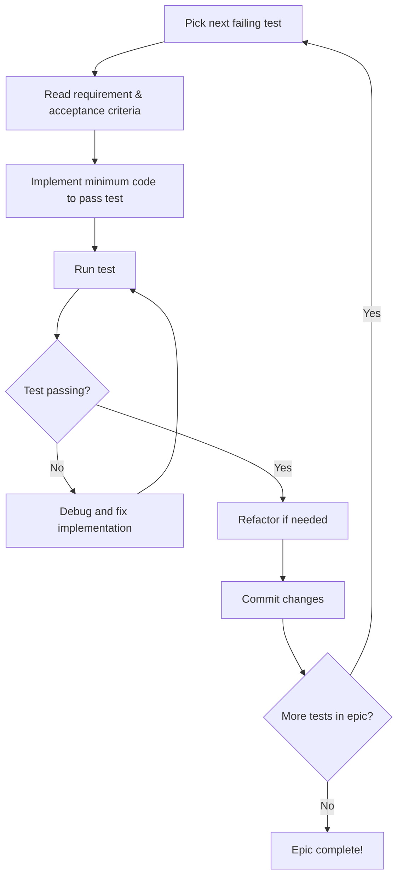

# Functional Test-Driven Development Guide

## Overview

This guide explains how to use the DealSphere Phase 1 Functional Test Suite for **Test-Driven Development (TDD)** at the functional level. The comprehensive test suite was designed upfront to guide development and ensure 100% coverage of business requirements.

## Quick Start

### 1. Understanding the Test Suite Structure

```
cypress/e2e/
├── epic-1-core-auth/         # Weeks 1-2: Authentication & RBAC
├── epic-2-users-documents/   # Weeks 3-4: User Management & Documents
├── epic-3-capital-waterfall/ # Weeks 5-6: Capital Calls & Waterfalls
└── epic-4-workflows-ai/      # Weeks 7-8: Workflows & AI Integration
```

### 2. Current Development Status

All tests are **initially failing** - this is by design! The failing tests serve as your development roadmap and executable specifications.

## Using Tests to Guide Development

### Step 1: Identify Your Development Epic

Based on the current development timeline:

| Weeks | Epic | Focus Area | Test Directory |
|-------|------|------------|----------------|
| 1-2 | Epic 1 | Core Framework & Auth | `epic-1-core-auth/` |
| 3-4 | Epic 2 | User Management & Documents | `epic-2-users-documents/` |
| 5-6 | Epic 3 | Capital Call & Waterfall | `epic-3-capital-waterfall/` |
| 7-8 | Epic 4 | Workflow Automation & AI | `epic-4-workflows-ai/` |

### Step 2: Run Epic-Specific Tests

```bash
# Run tests for your current epic
npx cypress run --spec "cypress/e2e/epic-1-core-auth/**"

# Run a specific test case
npx cypress run --spec "cypress/e2e/epic-1-core-auth/1.1.1-basic-login-authentication.cy.ts"
```

### Step 3: Read the Test Requirements

Each test includes detailed requirement information:

```typescript
/**
 * Epic: Core Framework & Auth
 * Official Test Case: 1.1.1
 * Business Requirements: User authentication (Login/Logout)
 * Development Timeline: Weeks 1-2
 */
describe('Epic 1: Core Auth - Test Case 1.1.1', () => {
  before(() => {
    cy.logEpicRequirement(
      'Core Framework & Auth',
      '1.1.1',
      'User authentication with valid credentials',
      'HIGH'
    )
  })

  it('should authenticate users with valid credentials', () => {
    cy.log('🧪 TESTING: Basic login functionality')
    cy.log('✅ ACCEPTANCE CRITERIA: User can login and access dashboard')

    // Implementation guidance through test expectations
    cy.visit('/login')
    cy.get('[data-testid="email-input"]').type('admin@dealsphere.com')
    cy.get('[data-testid="password-input"]').type('password123')
    cy.get('[data-testid="login-submit"]').click()

    // This will fail until you implement authentication
    cy.url().should('include', '/dashboard')
    cy.get('[data-testid="user-welcome"]').should('contain', 'Welcome')
  })
})
```

### Step 4: Implement to Make Tests Pass

1. **Read the test failure message** - It tells you exactly what's missing
2. **Implement the minimum code** to make the test pass
3. **Re-run the test** to verify it passes
4. **Move to the next test** in the epic

### Step 5: Verify Epic Completion

```bash
# Verify all tests in an epic are passing
npx cypress run --spec "cypress/e2e/epic-1-core-auth/**"

# Check overall progress
npm run test:coverage
```

## Development Workflow

### Daily Development Cycle



### Epic Development Cycle

1. **Start Epic** - Run all tests in epic directory (all should fail)
2. **Iterative Development** - Work through tests one by one
3. **Epic Completion** - All tests in epic pass
4. **Integration Testing** - Run full test suite to ensure no regressions

## Understanding Test Categories

### Authentication Tests (Epic 1)

```typescript
// Example: 1.1.1-basic-login-authentication.cy.ts
// WHAT IT TESTS: User can authenticate with valid credentials
// WHEN TO IMPLEMENT: Week 1-2, when building login system
// SUCCESS CRITERIA: User reaches dashboard after login

it('should authenticate users with valid credentials', () => {
  // Test expects login form, authentication API, and dashboard redirect
})
```

### Document Management Tests (Epic 2)

```typescript
// Example: 2.1.1-document-upload-class-isolation.cy.ts
// WHAT IT TESTS: Documents are isolated by class membership
// WHEN TO IMPLEMENT: Week 3-4, when building document system
// SUCCESS CRITERIA: Users only see documents for their class

it('should isolate documents by class membership', () => {
  // Test expects class-based document filtering
})
```

### Financial Operations Tests (Epic 3)

```typescript
// Example: 4.1.1-european-waterfall-model.cy.ts
// WHAT IT TESTS: European waterfall calculation model
// WHEN TO IMPLEMENT: Week 5-6, when building financial calculations
// SUCCESS CRITERIA: Accurate waterfall distributions per class

it('should calculate European waterfall distributions correctly', () => {
  // Test expects accurate financial calculations
})
```

## Best Practices

### 1. Read Tests Before Coding

- **Understand the business requirement** from the test description
- **Review acceptance criteria** in the test logs
- **Check epic documentation** for additional context

### 2. Implement Incrementally

- **Start with the simplest test** in each epic
- **Implement minimal code** to make tests pass
- **Refactor when multiple tests are passing**

### 3. Maintain Test Integrity

- **Never modify test expectations** to make implementation easier
- **Fix implementation to match test requirements**
- **Tests represent business requirements** - they are the source of truth

### 4. Use Test Feedback

- **Test failure messages guide implementation**
- **Console logs show requirement traceability**
- **Coverage reports show progress**

## Epic-Specific Guidance

### Epic 1: Core Framework & Auth (Weeks 1-2)

**Priority Order:**
1. `1.1.1` - Basic login authentication
2. `1.1.2` - Logout functionality
3. `1.1.3` - Role-based access control
4. `1.1.5` - Session management
5. `1.2.1-1.2.5` - Error scenarios

**Key Implementation Areas:**
- JWT authentication system
- Role-based permission checking
- Session management
- Security audit trails

### Epic 2: User Management & Documents (Weeks 3-4)

**Priority Order:**
1. `1.3.2` - User management CRUD
2. `2.1.1-2.1.4` - Document upload/download with class isolation
3. `2.2.1-2.2.4` - Document versioning
4. `2.3.1-2.3.3` - AI document categorization

**Key Implementation Areas:**
- User management APIs
- Document storage with class boundaries
- Version control system
- AI integration for document processing

### Epic 3: Capital Call & Waterfall (Weeks 5-6)

**Priority Order:**
1. `3.1.1-3.1.4` - Capital call management
2. `4.1.1-4.1.3` - Waterfall models
3. `4.2.1-4.2.4` - Calculation accuracy
4. `4.3.1-4.3.4` - Distribution algorithms

**Key Implementation Areas:**
- Capital call workflow engine
- Financial calculation models
- Payment processing integration
- Distribution algorithms

### Epic 4: Workflow Automation & AI (Weeks 7-8)

**Priority Order:**
1. Workflow approval systems
2. AI-assisted features
3. Integration validations
4. Performance optimizations

**Key Implementation Areas:**
- Workflow engine
- AI service integrations
- External system connectors
- Performance optimization

## Troubleshooting

### Common Issues

**Tests not running:**
```bash
# Check Cypress installation
npx cypress verify

# Install dependencies
npm install
```

**All tests failing:**
This is expected! Tests were written before implementation begins.

**Test data issues:**
```bash
# Reset test database
npm run test:db:reset

# Check test fixtures
cypress/fixtures/
```

**Authentication errors:**
Make sure test users exist in your database:
- admin@dealsphere.com
- gp@dealsphere.com
- lp-a@dealsphere.com
- lp-b@dealsphere.com
- auditor@dealsphere.com
- manager@dealsphere.com

## Success Metrics

### Epic Completion Criteria

✅ **All tests in epic pass**
✅ **No regressions in previous epics**
✅ **Integration tests pass**
✅ **Performance benchmarks met**

### Overall Project Success

- **47 functional tests passing**
- **100% epic coverage**
- **All business requirements validated**
- **Production-ready quality**

## Getting Help

### Documentation References

- **[Technical Specification](../qa/phase1-functional-test-suite-tech-spec.md)** - Complete test suite specification
- **[Phase 1 Epics](../planning/phase1-epics.md)** - Epic definitions and timelines
- **[Functional Test Cases](../qa/Phase1_Functional_Test_Cases.md)** - Official test case documentation

### Team Support

- **QA Team** - Test interpretation and requirements clarification
- **Product Team** - Business requirement questions
- **Architecture Team** - Technical implementation guidance

---

**Remember:** The tests are your specification. Trust them to guide your implementation toward the correct business outcomes! 🎯