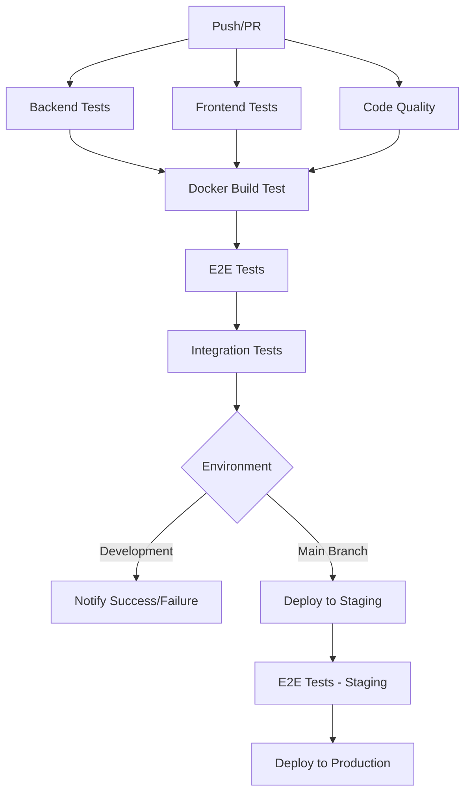

# GitHub Actions CI/CD Pipeline

This document provides comprehensive coverage of the GitHub Actions workflows used in the DealSphere platform, including configuration, customization, and troubleshooting.

## Pipeline Overview

The DealSphere platform uses multiple GitHub Actions workflows for comprehensive CI/CD:



## Workflow Files

### Main CI Pipeline

**File:** `.github/workflows/ci.yml`

**Triggers:**
- Push to `main` or `develop` branches
- Pull requests to `main` or `develop`
- Manual workflow dispatch

**Jobs Sequence:**
1. **backend-test** - Spring Boot tests with PostgreSQL
2. **frontend-test** - React/TypeScript tests and build
3. **code-quality** - SonarCloud analysis and security scanning
4. **docker-build-test** - Docker Compose integration testing
5. **e2e-test** - Cypress end-to-end testing
6. **integration-test** - API integration tests (main branch only)
7. **notify-success/failure** - Slack notifications

### Staging/Production E2E Tests

**File:** `.github/workflows/e2e-staging.yml`

**Triggers:**
- Manual workflow dispatch (environment selection)
- Scheduled daily runs against staging (6 AM UTC)

**Purpose:**
- Validate deployed applications
- Smoke testing after deployments
- Scheduled health checks

## Detailed Job Configuration

### Backend Tests

```yaml
backend-test:
  name: Backend Tests
  runs-on: ubuntu-latest

  services:
    postgres:
      image: postgres:16-alpine
      env:
        POSTGRES_DB: dealsphere_test
        POSTGRES_USER: test_user
        POSTGRES_PASSWORD: test_password
      ports:
        - 5432:5432
      options: >-
        --health-cmd pg_isready
        --health-interval 10s
        --health-timeout 5s
        --health-retries 5

  steps:
    - name: Checkout code
      uses: actions/checkout@v4

    - name: Set up JDK 17
      uses: actions/setup-java@v4
      with:
        java-version: '17'
        distribution: 'temurin'

    - name: Cache Gradle packages
      uses: actions/cache@v4
      with:
        path: |
          ~/.gradle/caches
          ~/.gradle/wrapper
        key: ${{ runner.os }}-gradle-${{ hashFiles('**/*.gradle*') }}

    - name: Run backend tests
      run: ./gradlew test
      working-directory: ./backend
      env:
        SPRING_DATASOURCE_URL: jdbc:postgresql://localhost:5432/dealsphere_test
        SPRING_DATASOURCE_USERNAME: test_user
        SPRING_DATASOURCE_PASSWORD: test_password
        JWT_SECRET: test-secret-key-for-ci-cd-pipeline-minimum-256-bits-long
```

**Key Features:**
- **PostgreSQL Service** - Real database for integration tests
- **Gradle Caching** - Speeds up dependency resolution
- **Test Reports** - JUnit XML output for GitHub
- **Environment Variables** - Test-specific configuration

### Frontend Tests

```yaml
frontend-test:
  name: Frontend Tests
  runs-on: ubuntu-latest

  steps:
    - name: Set up Node.js 20
      uses: actions/setup-node@v4
      with:
        node-version: '20'

    - name: Install pnpm
      uses: pnpm/action-setup@v3
      with:
        version: 8

    - name: Install dependencies
      run: pnpm install
      working-directory: ./frontend

    - name: Run linter
      run: pnpm run lint
      working-directory: ./frontend

    - name: Run frontend tests
      run: pnpm run test
      working-directory: ./frontend

    - name: Build frontend
      run: pnpm run build
      working-directory: ./frontend
```

**Key Features:**
- **pnpm Package Manager** - Faster, more efficient installs
- **Multi-step Validation** - Linting, testing, building
- **Build Artifact Verification** - Ensures production readiness

### E2E Tests with Cypress

```yaml
e2e-test:
  name: E2E Tests (Cypress)
  runs-on: ubuntu-latest
  needs: [docker-build-test]

  steps:
    - name: Start application stack
      run: |
        cp .env.development .env
        docker compose up -d --build

        # Wait for backend health check
        timeout 180 bash -c 'until curl -f http://localhost/actuator/health > /dev/null 2>&1; do sleep 5; done'

    - name: Run Cypress E2E tests
      uses: cypress-io/github-action@v6
      with:
        working-directory: frontend
        install: false
        wait-on: 'http://localhost'
        wait-on-timeout: 120
        config: baseUrl=http://localhost,video=true
      env:
        CYPRESS_BASE_URL: http://localhost

    - name: Upload artifacts on failure
      uses: actions/upload-artifact@v4
      if: failure()
      with:
        name: cypress-videos-${{ github.run_number }}
        path: frontend/cypress/videos
        retention-days: 7
```

**Key Features:**
- **Full Stack Testing** - Real application environment
- **Service Health Checks** - Ensures readiness before testing
- **Failure Artifacts** - Videos and screenshots for debugging
- **Cypress Dashboard Integration** - Test result recording

## Environment Variables and Secrets

### Repository Secrets

Configure these in GitHub repository settings:

```bash
# Required Secrets
SONAR_TOKEN=<sonarcloud-token>
SLACK_WEBHOOK_URL=<slack-webhook-url>

# Optional Secrets
CYPRESS_RECORD_KEY=<cypress-dashboard-key>
DOCKER_REGISTRY_TOKEN=<docker-registry-token>
```

### Environment Variables

**Development:**
```yaml
env:
  NODE_VERSION: '20'
  JAVA_VERSION: '17'
  POSTGRES_VERSION: '16'
```

**Test-specific:**
```yaml
env:
  SPRING_PROFILES_ACTIVE: test
  JWT_SECRET: test-secret-key-for-ci-cd-pipeline-minimum-256-bits-long
  CYPRESS_BASE_URL: http://localhost
```

## Caching Strategy

### Gradle Cache

```yaml
- name: Cache Gradle packages
  uses: actions/cache@v4
  with:
    path: |
      ~/.gradle/caches
      ~/.gradle/wrapper
    key: ${{ runner.os }}-gradle-${{ hashFiles('**/*.gradle*', '**/gradle-wrapper.properties') }}
    restore-keys: |
      ${{ runner.os }}-gradle-
```

### pnpm Cache

```yaml
- name: Get pnpm store directory
  shell: bash
  run: |
    echo "STORE_PATH=$(pnpm store path --silent)" >> $GITHUB_ENV

- name: Setup pnpm cache
  uses: actions/cache@v4
  with:
    path: ${{ env.STORE_PATH }}
    key: ${{ runner.os }}-pnpm-store-${{ hashFiles('**/pnpm-lock.yaml') }}
    restore-keys: |
      ${{ runner.os }}-pnpm-store-
```

### Docker Layer Cache

```yaml
- name: Set up Docker Buildx
  uses: docker/setup-buildx-action@v3
  with:
    driver-opts: image=moby/buildkit:master

- name: Build with cache
  uses: docker/build-push-action@v5
  with:
    context: .
    cache-from: type=gha
    cache-to: type=gha,mode=max
```

## Parallelization and Optimization

### Job Dependencies

```yaml
jobs:
  # Independent jobs (run in parallel)
  backend-test:
  frontend-test:
  code-quality:

  # Dependent jobs (run after dependencies complete)
  docker-build-test:
    needs: [backend-test, frontend-test]

  e2e-test:
    needs: [docker-build-test]
```

### Matrix Builds

```yaml
strategy:
  matrix:
    os: [ubuntu-latest, windows-latest, macos-latest]
    node-version: [18, 20]
    exclude:
      - os: windows-latest
        node-version: 18
```

### Conditional Execution

```yaml
# Only run on main branch
if: github.ref == 'refs/heads/main'

# Only run on pull requests
if: github.event_name == 'pull_request'

# Skip on draft PRs
if: github.event.pull_request.draft == false

# Run on schedule
if: github.event_name == 'schedule'
```

## Security and Best Practices

### Secret Management

```yaml
# ✅ Good - Use repository secrets
env:
  JWT_SECRET: ${{ secrets.JWT_SECRET }}

# ❌ Bad - Hardcoded secrets
env:
  JWT_SECRET: my-secret-key
```

### Permissions

```yaml
permissions:
  contents: read
  security-events: write
  actions: read
  id-token: write
```

### Supply Chain Security

```yaml
- name: Run Trivy vulnerability scanner
  uses: aquasecurity/trivy-action@master
  with:
    scan-type: 'fs'
    scan-ref: '.'
    format: 'sarif'
    output: 'trivy-results.sarif'

- name: Upload to GitHub Security tab
  uses: github/codeql-action/upload-sarif@v3
  with:
    sarif_file: 'trivy-results.sarif'
```

## Monitoring and Notifications

### Slack Integration

```yaml
- name: Slack notification on success
  uses: 8398a7/action-slack@v3
  with:
    status: success
    channel: '#ci-cd'
    text: |
      ✅ CI Pipeline passed for commit ${{ github.sha }}
      Branch: ${{ github.ref_name }}
      Author: ${{ github.actor }}
  env:
    SLACK_WEBHOOK_URL: ${{ secrets.SLACK_WEBHOOK_URL }}
```

### Failure Handling

```yaml
- name: Show Docker logs on failure
  if: failure()
  run: |
    echo "=== Docker Compose Services ==="
    docker compose ps
    echo "=== Backend Logs ==="
    docker compose logs backend --tail=100
```

## Workflow Customization

### Adding New Tests

1. **Create test job:**
```yaml
new-test-type:
  name: New Test Type
  runs-on: ubuntu-latest
  needs: [existing-job]

  steps:
    - name: Run new tests
      run: |
        # Your test commands
```

2. **Update dependencies:**
```yaml
notify-success:
  needs: [backend-test, frontend-test, new-test-type]
```

### Environment-Specific Workflows

```yaml
# .github/workflows/staging-deploy.yml
name: Deploy to Staging

on:
  push:
    branches: [develop]

jobs:
  deploy-staging:
    environment: staging
    runs-on: ubuntu-latest

    steps:
      # Deployment steps
```

### Custom Actions

Create reusable actions:

```yaml
# .github/actions/setup-app/action.yml
name: 'Setup Application'
description: 'Setup Node.js, pnpm, and dependencies'

inputs:
  node-version:
    description: 'Node.js version'
    required: false
    default: '20'

runs:
  using: 'composite'
  steps:
    - name: Setup Node.js
      uses: actions/setup-node@v4
      with:
        node-version: ${{ inputs.node-version }}
```

## Troubleshooting

### Common Issues

#### 1. Test Timeouts
```yaml
# Increase timeouts
- name: Run tests with extended timeout
  run: pnpm test
  timeout-minutes: 15
```

#### 2. Service Health Checks
```yaml
# Add better health checks
- name: Wait for services
  run: |
    timeout 300 bash -c 'until docker compose ps | grep -q "healthy"; do sleep 10; done'
```

#### 3. Cache Issues
```yaml
# Clear cache on failures
- name: Clear cache
  if: failure()
  run: |
    rm -rf ~/.gradle/caches
    rm -rf ~/.pnpm-store
```

### Debug Mode

```yaml
# Enable debug logging
- name: Enable debug
  run: echo "ACTIONS_STEP_DEBUG=true" >> $GITHUB_ENV

# Add debug information
- name: Debug information
  run: |
    echo "Runner OS: ${{ runner.os }}"
    echo "GitHub workspace: ${{ github.workspace }}"
    docker version
    docker compose version
```

### Performance Issues

#### Optimize Job Execution
```yaml
# Use faster runners for critical paths
runs-on: ubuntu-latest-4-cores

# Optimize Docker builds
- name: Build with BuildKit
  run: |
    export DOCKER_BUILDKIT=1
    export COMPOSE_DOCKER_CLI_BUILD=1
    docker compose build
```

#### Reduce Test Execution Time
```yaml
# Run tests in parallel
strategy:
  matrix:
    test-group: [unit, integration, e2e]

# Skip unnecessary steps
- name: Skip build on docs changes
  if: contains(github.event.head_commit.message, '[skip ci]')
  run: echo "Skipping CI"
```

## Advanced Features

### Workflow Artifacts

```yaml
- name: Upload test results
  uses: actions/upload-artifact@v4
  with:
    name: test-results-${{ github.run_number }}
    path: |
      backend/core/build/test-results/
      frontend/coverage/
    retention-days: 30
```

### Dynamic Configuration

```yaml
- name: Set environment variables
  run: |
    if [[ "${{ github.ref }}" == "refs/heads/main" ]]; then
      echo "ENVIRONMENT=production" >> $GITHUB_ENV
    else
      echo "ENVIRONMENT=development" >> $GITHUB_ENV
    fi
```

### Workflow Templates

Create organization-wide templates:

```yaml
# .github/workflow-templates/ci-template.yml
name: CI Template

on:
  push:
    branches: [ $default-branch ]

jobs:
  ci:
    runs-on: ubuntu-latest
    steps:
      # Template steps
```

## Related Documentation

- [Local CI/CD Setup](local-cicd-setup.md)
- [Cypress E2E Testing](cypress-e2e-testing.md)
- [Docker Development](docker-development.md)
- [Environment Configuration](environment-config.md)