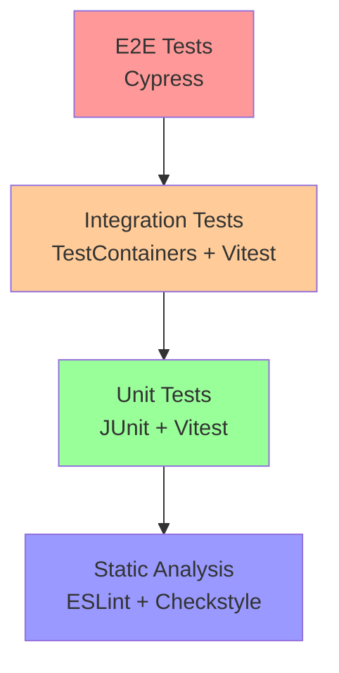

# Testing Strategy

## Overview

The DealSphere platform implements a comprehensive testing strategy covering unit tests, integration tests, end-to-end tests, and security tests. This document outlines our testing approach, tools, and best practices.

## Testing Pyramid



## Backend Testing

### Unit Tests

**Framework**: JUnit 5 + Mockito
**Location**: `backend/**/src/test/java/`
**Coverage Target**: 85%+

#### Authentication Service Tests

**File**: `AuthServiceImplTest.java`

```java
@ExtendWith(MockitoExtension.class)
class AuthServiceImplTest {

    @Mock private UserProfileRepository userProfileRepository;
    @Mock private UserCredentialsRepository userCredentialsRepository;
    @Mock private PasswordEncoder passwordEncoder;
    @Mock private JwtService jwtService;
    @Mock private SecurityAuditService securityAuditService;

    @InjectMocks private AuthServiceImpl authService;

    @Test
    void login_WithValidCredentials_ShouldReturnAuthPayload() {
        // Given
        when(userProfileRepository.findByEmail("test@example.com"))
            .thenReturn(Optional.of(testUserProfile));
        when(passwordEncoder.matches("password123", "hashedPassword"))
            .thenReturn(true);
        when(jwtService.generateToken(testUserProfile))
            .thenReturn("jwt-token");

        // When
        AuthPayload result = authService.login(validLoginInput);

        // Then
        assertThat(result.getToken()).isEqualTo("jwt-token");
        verify(securityAuditService).logLoginSuccess(eq("user-123"), any());
    }
}
```

#### JWT Service Tests

**File**: `JwtServiceImplTest.java`

```java
class JwtServiceImplTest {

    @Test
    void generateToken_ShouldCreateValidToken() {
        // When
        String token = jwtService.generateToken(testUser);

        // Then
        assertThat(token).isNotNull();
        assertTrue(jwtService.validateToken(token));
        assertThat(jwtService.extractUserId(token)).isEqualTo("user-123");
    }

    @Test
    void validateToken_WithExpiredToken_ShouldReturnFalse() {
        // Given - create expired token
        String expiredToken = createExpiredToken();

        // When
        boolean isValid = jwtService.validateToken(expiredToken);

        // Then
        assertFalse(isValid);
    }
}
```

#### Security Audit Tests

**File**: `SecurityAuditServiceImplTest.java`

```java
class SecurityAuditServiceImplTest {

    @Test
    void logLoginFailure_ShouldLogStructuredEvent() {
        // Given
        String email = "test@example.com";
        String reason = "Invalid password";

        // When
        securityAuditService.logLoginFailure(email, reason, request);

        // Then - Verify structured logging would occur
        // In production, this verifies external observability integration
        assertThat(email).isEqualTo("test@example.com");
        assertThat(reason).isEqualTo("Invalid password");
    }

    @Test
    void checkComplianceViolations_WithSensitiveDataExport_ShouldLogViolation() {
        // Given
        Map<String, Object> context = Map.of("sensitive_data", true);

        // When
        securityAuditService.checkComplianceViolations("user-123", "export_user_data", context);

        // Then
        assertThat(context).containsKey("sensitive_data");
    }
}
```

### Integration Tests

**Framework**: Spring Boot Test + TestContainers
**Location**: `backend/core/src/test/java/integration/`

#### Database Integration

```java
@SpringBootTest
@TestPropertySource(properties = "spring.jpa.hibernate.ddl-auto=create-drop")
@Testcontainers
class AuthIntegrationTest {

    @Container
    static PostgreSQLContainer<?> postgres = new PostgreSQLContainer<>("postgres:14")
            .withDatabaseName("testdb")
            .withUsername("test")
            .withPassword("test");

    @DynamicPropertySource
    static void configureProperties(DynamicPropertyRegistry registry) {
        registry.add("spring.datasource.url", postgres::getJdbcUrl);
        registry.add("spring.datasource.username", postgres::getUsername);
        registry.add("spring.datasource.password", postgres::getPassword);
    }

    @Test
    @Transactional
    void completeAuthenticationFlow_ShouldWork() {
        // Test complete flow: invite → register → login → access protected resource

        // 1. Admin invites user
        InvitationPayload invitation = authService.inviteUser(inviteInput, adminId);
        assertThat(invitation.getSuccess()).isTrue();

        // 2. User completes registration
        CompleteRegistrationInput regInput = new CompleteRegistrationInput();
        regInput.setInvitationToken(invitation.getInvitationId());
        regInput.setPassword("newpassword123");

        AuthPayload authResult = authService.completeRegistration(regInput);
        assertThat(authResult.getToken()).isNotNull();

        // 3. User can login with new credentials
        LoginInput loginInput = new LoginInput();
        loginInput.setEmail("newuser@example.com");
        loginInput.setPassword("newpassword123");

        AuthPayload loginResult = authService.login(loginInput);
        assertThat(loginResult.getToken()).isNotNull();
    }
}
```

#### GraphQL Integration Tests

```java
@SpringBootTest(webEnvironment = SpringBootTest.WebEnvironment.RANDOM_PORT)
@AutoConfigureTestDatabase(replace = AutoConfigureTestDatabase.Replace.NONE)
class GraphQLAuthIntegrationTest {

    @Test
    void loginMutation_WithValidCredentials_ShouldReturnToken() throws Exception {
        String query = """
            mutation Login($input: LoginInput!) {
                login(input: $input) {
                    token
                    user {
                        id
                        email
                        firstName
                        lastName
                    }
                }
            }
        """;

        mockMvc.perform(post("/graphql")
                .contentType(MediaType.APPLICATION_JSON)
                .content(createGraphQLRequest(query, loginVariables)))
                .andExpect(status().isOk())
                .andExpect(jsonPath("$.data.login.token").exists())
                .andExpect(jsonPath("$.data.login.user.email").value("test@example.com"));
    }
}
```

### Performance Tests

**Framework**: JMeter + Gatling (planned)
**Target**: 1000 concurrent users, <200ms response time

```java
@Test
@Timeout(value = 2, unit = TimeUnit.SECONDS)
void loginEndpoint_ShouldHandleHighLoad() {
    // Simulate concurrent login attempts
    CompletableFuture<?>[] futures = IntStream.range(0, 100)
        .mapToObj(i -> CompletableFuture.runAsync(() -> {
            try {
                authService.login(createUniqueLoginInput(i));
            } catch (Exception e) {
                // Expected for some invalid attempts
            }
        }))
        .toArray(CompletableFuture[]::new);

    CompletableFuture.allOf(futures).join();

    // Verify system remains responsive
    assertTrue(authService.login(validLoginInput).getToken() != null);
}
```

## Frontend Testing

### Unit Tests

**Framework**: Vitest + Testing Library
**Location**: `frontend/src/**/__tests__/`
**Coverage Target**: 85%+

#### Component Tests

**File**: `Login.test.tsx`

```typescript
describe('Login Component', () => {
  it('should validate email format', async () => {
    renderWithProviders(<Login />);

    const emailInput = screen.getByLabelText(/email/i);
    fireEvent.change(emailInput, { target: { value: 'invalid-email' } });
    fireEvent.blur(emailInput);

    await waitFor(() => {
      expect(screen.getByText(/please enter a valid email address/i)).toBeInTheDocument();
    });
  });

  it('should prevent XSS attacks', async () => {
    renderWithProviders(<Login />);

    const emailInput = screen.getByLabelText(/email/i);
    fireEvent.change(emailInput, { target: { value: '<script>alert("xss")</script>' } });
    fireEvent.blur(emailInput);

    await waitFor(() => {
      expect(screen.getByText(/potentially malicious content detected/i)).toBeInTheDocument();
    });
  });

  it('should handle login success', async () => {
    const loginMock = {
      request: { query: LOGIN_MUTATION, variables: { input: validCredentials } },
      result: { data: { login: { token: 'mock-token', user: mockUser } } }
    };

    renderWithProviders(<Login />, [loginMock]);

    // Fill form and submit
    fireEvent.change(screen.getByLabelText(/email/i), { target: { value: 'test@example.com' } });
    fireEvent.change(screen.getByLabelText(/password/i), { target: { value: 'password123' } });
    fireEvent.click(screen.getByRole('button', { name: /sign in/i }));

    await waitFor(() => {
      expect(mockNavigate).toHaveBeenCalledWith('/dashboard');
    });
  });
});
```

#### Hook Tests

**File**: `useAuth.test.ts`

```typescript
describe('useAuth Hook', () => {
  it('should handle successful login', async () => {
    const loginMock = createLoginMock();
    const { result } = renderHook(() => useAuth(), {
      wrapper: createWrapper([loginMock])
    });

    await act(async () => {
      await result.current.login('test@example.com', 'password123');
    });

    expect(result.current.isAuthenticated).toBe(true);
    expect(result.current.user).toEqual(mockUser);
    expect(localStorage.setItem).toHaveBeenCalledWith('auth_token', 'mock-token');
  });

  it('should handle token refresh', async () => {
    const refreshMock = createRefreshMock();
    const { result } = renderHook(() => useAuth(), {
      wrapper: createWrapper([refreshMock])
    });

    await act(async () => {
      await result.current.refreshToken();
    });

    expect(result.current.token).toBe('refreshed-token');
  });
});
```

#### Validation Utilities Tests

**File**: `validation.test.ts`

```typescript
describe('Validation Utilities', () => {
  describe('sanitizeXSS', () => {
    it('should sanitize script tags', () => {
      const malicious = '<script>alert("xss")</script>';
      const sanitized = sanitizeXSS(malicious);

      expect(sanitized).not.toContain('<script>');
      expect(sanitized).not.toContain('alert');
    });

    it('should preserve safe content', () => {
      const safe = 'This is safe content with numbers 123';
      const result = sanitizeXSS(safe);

      expect(result).toContain('This is safe content');
      expect(result).toContain('123');
    });
  });

  describe('detectSQLInjection', () => {
    it('should detect SQL injection patterns', () => {
      expect(detectSQLInjection("'; DROP TABLE users; --")).toBe(true);
      expect(detectSQLInjection("' OR '1'='1")).toBe(true);
      expect(detectSQLInjection("admin'--")).toBe(true);
    });

    it('should not flag safe content', () => {
      expect(detectSQLInjection('user@example.com')).toBe(false);
      expect(detectSQLInjection('password123')).toBe(false);
    });
  });
});
```

### Integration Tests

**File**: `auth-flow.integration.test.tsx`

```typescript
describe('Authentication Flow Integration', () => {
  it('should complete full login flow', async () => {
    const loginMock = createLoginMock();
    render(<TestApp mocks={[loginMock]} />);

    // Navigate to login
    window.history.pushState({}, 'Login', '/login');

    // Fill and submit form
    fireEvent.change(screen.getByLabelText(/email/i), { target: { value: 'test@example.com' } });
    fireEvent.change(screen.getByLabelText(/password/i), { target: { value: 'password123' } });
    fireEvent.click(screen.getByRole('button', { name: /sign in/i }));

    // Verify success
    await waitFor(() => {
      expect(localStorage.setItem).toHaveBeenCalledWith('auth_token', 'mock-token');
    });
  });

  it('should complete invitation flow', async () => {
    const inviteMock = createInviteMock();
    const completeMock = createCompleteMock();

    render(<TestApp mocks={[inviteMock, completeMock]} />);

    // Admin sends invitation
    window.history.pushState({}, 'Invite', '/invite');
    fillInvitationForm();
    fireEvent.click(screen.getByRole('button', { name: /send invitation/i }));

    await waitFor(() => {
      expect(screen.getByText(/invitation sent successfully/i)).toBeInTheDocument();
    });

    // User completes registration
    window.history.pushState({}, 'Complete', '/complete-registration?token=invitation-123');
    fillRegistrationForm();
    fireEvent.click(screen.getByRole('button', { name: /complete registration/i }));

    await waitFor(() => {
      expect(localStorage.setItem).toHaveBeenCalledWith('auth_token', 'new-user-token');
    });
  });
});
```

## End-to-End Tests

**Framework**: Cypress
**Location**: `frontend/cypress/e2e/`

### Authentication E2E Tests

**File**: `auth-flow.cy.ts`

```typescript
describe('Authentication Flow', () => {
  beforeEach(() => {
    // Reset database state
    cy.task('db:reset');
    // Setup test data
    cy.task('db:seed');
  });

  it('should login successfully with valid credentials', () => {
    cy.visit('/login');

    cy.get('[data-testid="email-input"]').type('admin@example.com');
    cy.get('[data-testid="password-input"]').type('password123');
    cy.get('[data-testid="login-button"]').click();

    cy.url().should('include', '/dashboard');
    cy.get('[data-testid="user-menu"]').should('contain', 'Admin User');
  });

  it('should handle invitation flow', () => {
    // Login as admin
    cy.login('admin@example.com', 'password123');

    // Send invitation
    cy.visit('/users/invite');
    cy.get('[data-testid="email-input"]').type('newuser@example.com');
    cy.get('[data-testid="first-name-input"]').type('New');
    cy.get('[data-testid="last-name-input"]').type('User');
    cy.get('[data-testid="send-invitation-button"]').click();

    cy.get('[data-testid="success-message"]').should('contain', 'Invitation sent');

    // Get invitation token from email (mocked)
    cy.task('getLastEmail').then((email: any) => {
      const invitationToken = extractTokenFromEmail(email.content);

      // Complete registration
      cy.visit(`/complete-registration?token=${invitationToken}`);
      cy.get('[data-testid="password-input"]').type('newpassword123');
      cy.get('[data-testid="confirm-password-input"]').type('newpassword123');
      cy.get('[data-testid="complete-button"]').click();

      cy.url().should('include', '/dashboard');
    });
  });

  it('should handle password reset flow', () => {
    cy.visit('/reset-password');

    cy.get('[data-testid="email-input"]').type('user@example.com');
    cy.get('[data-testid="send-reset-button"]').click();

    cy.get('[data-testid="success-message"]').should('contain', 'Reset instructions sent');

    // Get reset token from email (mocked)
    cy.task('getLastEmail').then((email: any) => {
      const resetToken = extractTokenFromEmail(email.content);

      cy.visit(`/reset-password/confirm?token=${resetToken}`);
      cy.get('[data-testid="new-password-input"]').type('newpassword123');
      cy.get('[data-testid="confirm-password-input"]').type('newpassword123');
      cy.get('[data-testid="reset-button"]').click();

      cy.get('[data-testid="success-message"]').should('contain', 'Password reset successful');
    });
  });
});
```

### Security E2E Tests

**File**: `security.cy.ts`

```typescript
describe('Security Tests', () => {
  it('should prevent XSS attacks', () => {
    cy.visit('/login');

    const xssPayload = '<script>alert("xss")</script>';
    cy.get('[data-testid="email-input"]').type(xssPayload);
    cy.get('[data-testid="email-input"]').blur();

    cy.get('[data-testid="error-message"]').should('contain', 'malicious content detected');
    cy.get('[data-testid="login-button"]').should('be.disabled');
  });

  it('should prevent SQL injection', () => {
    cy.visit('/login');

    const sqlPayload = "'; DROP TABLE users; --";
    cy.get('[data-testid="email-input"]').type(sqlPayload);
    cy.get('[data-testid="email-input"]').blur();

    cy.get('[data-testid="error-message"]').should('contain', 'malicious content detected');
  });

  it('should enforce rate limiting', () => {
    cy.visit('/login');

    // Attempt multiple failed logins
    for (let i = 0; i < 6; i++) {
      cy.get('[data-testid="email-input"]').clear().type('test@example.com');
      cy.get('[data-testid="password-input"]').clear().type('wrongpassword');
      cy.get('[data-testid="login-button"]').click();

      if (i < 5) {
        cy.get('[data-testid="error-message"]').should('contain', 'Invalid credentials');
      }
    }

    // 6th attempt should be rate limited
    cy.get('[data-testid="error-message"]').should('contain', 'Too many attempts');
  });
});
```

## Security Testing

### Penetration Testing

#### Automated Security Scans

```bash
# OWASP ZAP automated scan
docker run -t owasp/zap2docker-stable zap-baseline.py \
  -t http://localhost:3000 \
  -g gen.conf \
  -r zap-report.html

# Nmap port scan
nmap -sV -sC localhost

# SSL/TLS testing
testssl.sh localhost:443
```

#### Manual Security Tests

```java
@Test
class SecurityTest {

    @Test
    void shouldPreventSQLInjection() {
        // Test various SQL injection payloads
        String[] payloads = {
            "'; DROP TABLE users; --",
            "' OR '1'='1",
            "'; INSERT INTO users VALUES('hacker', 'pass'); --",
            "' UNION SELECT password FROM users WHERE '1'='1"
        };

        for (String payload : payloads) {
            LoginInput input = new LoginInput();
            input.setEmail(payload);
            input.setPassword("password");

            assertThrows(BadCredentialsException.class, () -> authService.login(input));
        }
    }

    @Test
    void shouldPreventXSSAttacks() {
        String[] xssPayloads = {
            "<script>alert('xss')</script>",
            "javascript:alert('xss')",
            "",
            "<iframe src=javascript:alert('xss')></iframe>"
        };

        for (String payload : xssPayloads) {
            InviteUserInput input = new InviteUserInput();
            input.setEmail("test@example.com");
            input.setFirstName(payload);

            boolean result = validationService.validateInput(input.getFirstName());
            assertFalse(result, "XSS payload should be detected: " + payload);
        }
    }
}
```

## Performance Testing

### Load Testing

**Framework**: Gatling
**Location**: `performance-tests/`

```scala
class AuthLoadTest extends Simulation {

  val httpProtocol = http
    .baseUrl("http://localhost:8080")
    .acceptHeader("application/json")

  val loginScenario = scenario("Login Load Test")
    .exec(http("login")
      .post("/graphql")
      .header("Content-Type", "application/json")
      .body(StringBody("""
        {
          "query": "mutation { login(input: { email: \"${email}\", password: \"${password}\" }) { token user { id } } }"
        }
      """))
      .check(status.is(200))
      .check(jsonPath("$.data.login.token").exists))

  setUp(
    loginScenario.inject(
      constantUsersPerSec(10) during (30 seconds),
      rampUsersPerSec(10) to 50 during (60 seconds),
      constantUsersPerSec(50) during (120 seconds)
    )
  ).protocols(httpProtocol)
}
```

### Stress Testing

```typescript
// Frontend stress test
describe('Frontend Performance', () => {
  it('should handle rapid form submissions', async () => {
    renderWithProviders(<Login />);

    const submitPromises = Array.from({ length: 100 }, () => {
      return new Promise<void>((resolve) => {
        setTimeout(() => {
          fireEvent.click(screen.getByRole('button', { name: /sign in/i }));
          resolve();
        }, Math.random() * 100);
      });
    });

    await Promise.all(submitPromises);

    // Component should remain responsive
    expect(screen.getByLabelText(/email/i)).toBeInTheDocument();
  });
});
```

## Test Data Management

### Test Database Setup

**TestContainers Configuration**:

```java
@TestConfiguration
public class TestDatabaseConfig {

    @Bean
    @Primary
    @ConfigurationProperties("spring.datasource")
    public DataSource testDataSource() {
        return DataSourceBuilder.create()
            .driverClassName("org.testcontainers.jdbc.ContainerDatabaseDriver")
            .url("jdbc:tc:postgresql:14:///testdb")
            .build();
    }
}
```

### Data Factories

```java
@Component
public class TestDataFactory {

    public UserProfile createTestUser(String email) {
        return UserProfile.builder()
            .id(UUID.randomUUID().toString())
            .email(email)
            .firstName("Test")
            .lastName("User")
            .isActive(true)
            .createdAt(OffsetDateTime.now())
            .build();
    }

    public UserCredentials createTestCredentials(UserProfile user, String password) {
        return UserCredentials.builder()
            .userId(user.getId())
            .username(user.getEmail())
            .passwordHash(passwordEncoder.encode(password))
            .userProfile(user)
            .build();
    }
}
```

## Test Automation & CI/CD

### GitHub Actions Pipeline

```yaml
name: Test Suite

on: [push, pull_request]

jobs:
  backend-tests:
    runs-on: ubuntu-latest
    steps:
      - uses: actions/checkout@v3

      - name: Set up Java
        uses: actions/setup-java@v3
        with:
          java-version: '17'

      - name: Run unit tests
        run: ./gradlew test

      - name: Run integration tests
        run: ./gradlew integrationTest

      - name: Generate test report
        run: ./gradlew jacocoTestReport

      - name: Upload coverage to Codecov
        uses: codecov/codecov-action@v3

  frontend-tests:
    runs-on: ubuntu-latest
    steps:
      - uses: actions/checkout@v3

      - name: Set up Node.js
        uses: actions/setup-node@v3
        with:
          node-version: '18'

      - name: Install dependencies
        run: pnpm install

      - name: Run unit tests
        run: pnpm test:coverage

      - name: Run E2E tests
        run: pnpm test:e2e

      - name: Upload coverage
        uses: codecov/codecov-action@v3

  security-tests:
    runs-on: ubuntu-latest
    steps:
      - uses: actions/checkout@v3

      - name: Run security scan
        uses: securecodewarrior/github-action-add-sarif@v1
        with:
          sarif-file: security-scan-results.sarif
```

### Test Reports

#### Coverage Reports

- **Backend**: JaCoCo HTML reports
- **Frontend**: Vitest coverage reports
- **Combined**: SonarQube integration

#### Test Execution Reports

- **JUnit XML**: For CI/CD integration
- **Allure Reports**: For detailed test documentation
- **Performance Reports**: Gatling HTML reports

## Test Quality Gates

### Coverage Thresholds

```yaml
# sonar-project.properties
sonar.coverage.jacoco.xmlReportPaths=backend/build/reports/jacoco/test/jacocoTestReport.xml
sonar.javascript.lcov.reportPaths=frontend/coverage/lcov.info

# Quality gates
sonar.coverage.threshold=80
sonar.duplication.threshold=5
sonar.maintainability.rating=A
sonar.reliability.rating=A
sonar.security.rating=A
```

### Test Execution Requirements

1. **All tests must pass** before merge
2. **Coverage must be >= 80%** for new code
3. **No security vulnerabilities** in dependencies
4. **Performance tests** must meet SLA requirements
5. **E2E tests** must pass in staging environment

## Best Practices

### Test Organization

```
backend/src/test/java/
├── unit/                    # Fast, isolated unit tests
│   ├── service/
│   ├── controller/
│   └── util/
├── integration/             # Component integration tests
│   ├── repository/
│   ├── service/
│   └── graphql/
└── e2e/                     # End-to-end tests
    ├── auth/
    └── user/

frontend/src/
├── components/__tests__/    # Component unit tests
├── hooks/__tests__/         # Hook tests
├── utils/__tests__/         # Utility tests
├── test/integration/        # Integration tests
└── cypress/e2e/            # E2E tests
```

### Test Naming Conventions

```java
// Backend: Given_When_Then format
@Test
void login_WithInvalidPassword_ShouldThrowBadCredentialsException() {
    // Test implementation
}

// Frontend: Should format
it('should prevent XSS attacks in email field', () => {
    // Test implementation
});
```

### Test Data Management

1. **Use builders** for complex test objects
2. **Clean up after tests** (database, files, etc.)
3. **Use factories** for consistent test data
4. **Isolate test data** between test cases
5. **Use realistic test data** that resembles production

### Mocking Guidelines

1. **Mock external dependencies** (APIs, databases in unit tests)
2. **Don't mock value objects** (DTOs, entities)
3. **Use TestContainers** for integration tests
4. **Verify interactions** on mocks when behavior matters
5. **Reset mocks** between tests

This comprehensive testing strategy ensures high-quality, secure, and reliable authentication functionality across the entire DealSphere platform.